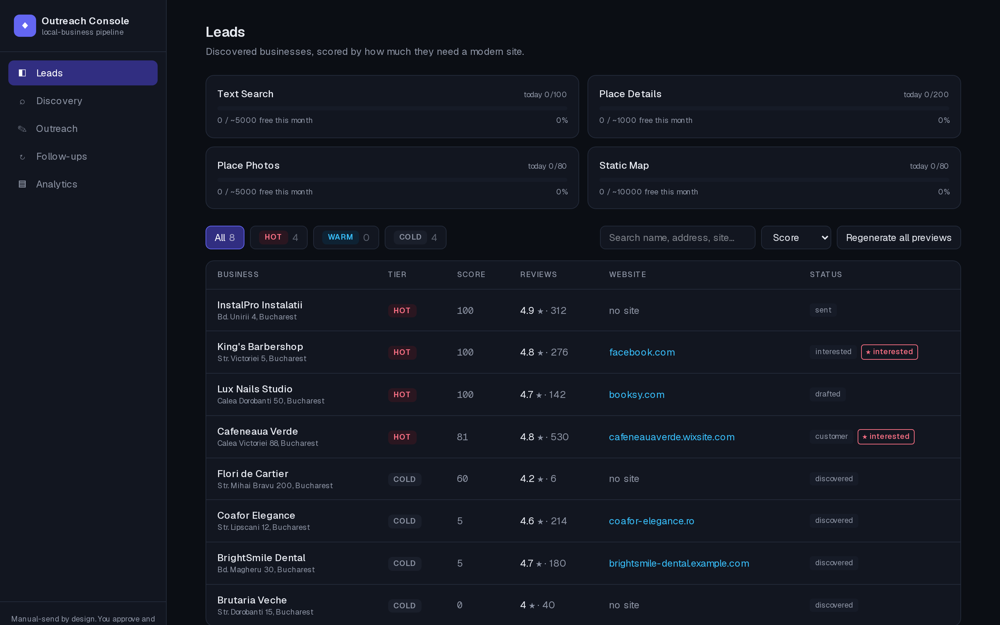
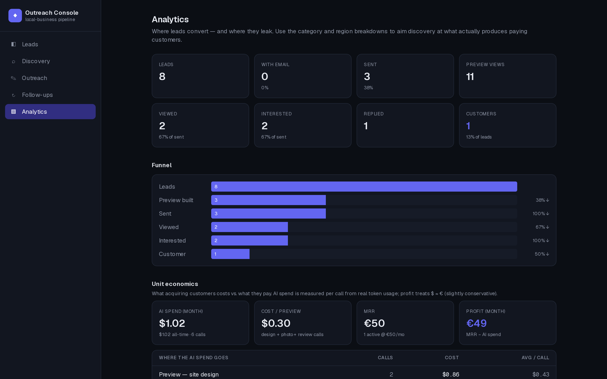
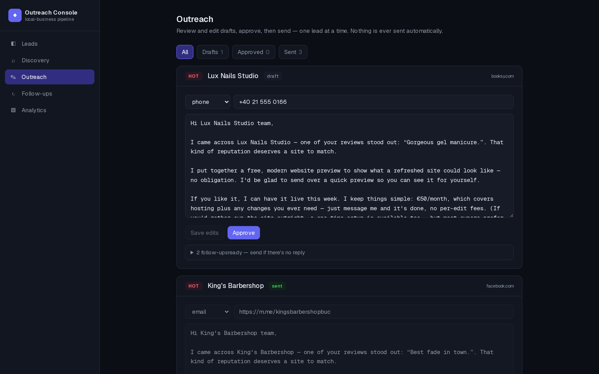
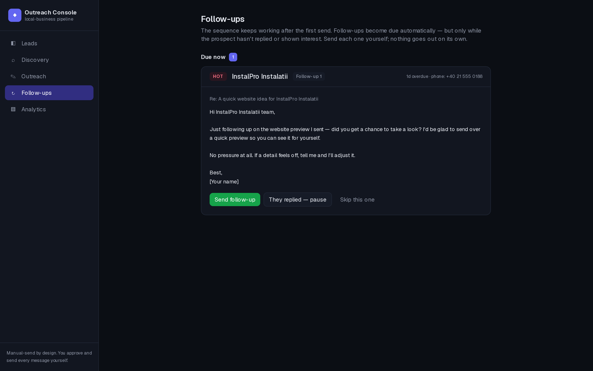
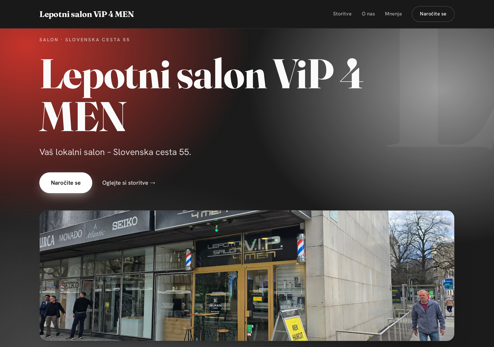
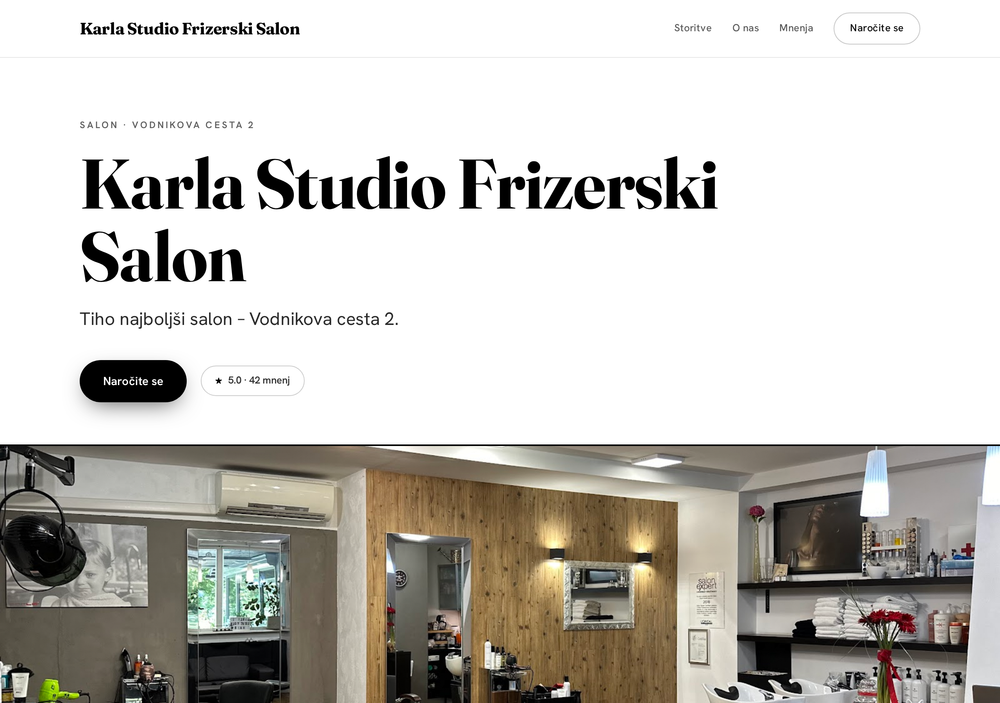

# Outreach Console

A full-stack web app that runs a complete local-business acquisition pipeline:
it **finds** local businesses with a weak or missing web presence, **scores**
them into tiers, **designs a real website for each one with Claude**, drafts a
personalized outreach sequence, tracks whether the prospect opened the demo,
takes payment through Stripe, and deploys the site once they pay.

Discovery → qualification → AI-generated demo site → outreach → follow-ups →
payment → deploy, in one dashboard, with per-call cost accounting at every step.

> **Human-in-the-loop by default.** The first message to any prospect is always
> reviewed and sent by a human. Only *follow-ups already approved as part of an
> existing sequence* can be delivered automatically, and only over email, and
> only if you explicitly turn that on (`AUTO_SEND_FOLLOWUPS=on`). Sequences
> pause the instant a prospect replies. See
> [Compliance](#compliance--your-responsibility).

## Screenshots

> The dashboard shots run on the bundled **mock data source** — the businesses
> shown are fictional. The generated sites are real output from the AI engine.

| | |
| --- | --- |
|  **Leads** — scored by how much each business needs a site, with live per-SKU API budget above. |  **Analytics** — funnel, conversion at each stage, and what a customer actually costs in AI spend. |
|  **Outreach** — review, edit, approve, send. Each draft carries two queued follow-ups. |  **Follow-ups** — due, scheduled, and paused, with the reason a sequence stopped. |

### Sites designed by Claude

Three different businesses, same code path — no shared template. Art direction
is seeded per business and the prompt actively bans the model's default look.
Copy is localized from the business's country (these are Slovene).

| | | |
| --- | --- | --- |
|  |  |  |

## Stack

| Layer | Choice |
| --- | --- |
| Framework | **Next.js 16 (App Router) + React 19 + TypeScript** — one codebase for UI and backend |
| Styling | **Tailwind CSS v4** |
| Data | **Prisma 7 + SQLite** via the `better-sqlite3` driver adapter — no external DB to run |
| AI | **Anthropic Claude SDK** — Opus for site design, Haiku for vision + review mining |
| Rendering | **Playwright** (headless Chromium) for hero screenshots |
| Email | **Nodemailer** over SMTP |
| Payments | **Stripe** hosted Checkout + webhooks |
| Validation | **Zod 4** |

Every API key is read server-side only and never reaches the browser.

## What it does

### 1. Discovery — the official Places API, never scraping

Businesses are found through the **Google Places API (New)**. The data source
sits behind a small `LeadSource` interface (`search` + `details`, returning a
normalized internal shape), so Google is just the first implementation — a
`mock` source ships for offline development, and OpenStreetMap or Foursquare
could be added as one new file plus a change to `LEAD_SOURCE`. Nothing
downstream ever touches raw Google JSON.

### 2. Qualification — score, don't just filter

The driving insight: **a business with an outdated site is a warmer lead than
one with no site**, because it already believes a website is worth paying for.
So leads aren't filtered, they're scored:

- **HOT** — has a website that looks weak or outdated. Detected by fetching the
  site (short timeout, graceful failure) and stacking signals: free-host
  subdomain, no HTTPS, stale copyright year, missing responsive viewport,
  table-based layout, Flash references, broken or near-empty page.
- **WARM** — strong reviews and rating (a real, active business) but **no
  website** — including businesses that exist only on Facebook, Instagram, or a
  booking/marketplace platform, which the qualifier detects separately.
- **COLD** — no site and thin reviews, an already-modern site, or closed.

Each lead stores its tier, a human-readable reason, and the raw signal map, so
every score can be audited in the UI.

### 3. Preview — Claude designs a bespoke site per business

The interesting part. A deterministic template makes every salon look identical,
which reads as spam. Instead, `PREVIEW_ENGINE=ai` has Claude design a complete,
self-contained HTML page from scratch for **that one business** — its own
layout, type system, palette, and motion — using the real name, category,
photos, rating, and review text.

Making that produce genuinely different sites rather than the same house style
forty times took the bulk of the engineering:

- **Seeded art direction** (`preview/designTokens.ts`) — palette, type set,
  composition, and motion signature are chosen deterministically per `placeId`
  and handed to the model as a hard specification, not a suggestion. A
  `previewVariant` counter re-rolls the direction on regeneration.
- **Explicit anti-convergence rules** — the prompt names the model's own default
  aesthetic (cream background, oversized left-aligned display type, photo on the
  right, dark pill CTA) and bans it.
- **Photos never enter the prompt.** Images are large base64 blobs, so Claude
  designs against `{{PHOTO_0}}` placeholders and the real bytes are substituted
  afterwards — a large token saving with no loss of fidelity.
- **Cheap models for the cheap jobs** — Haiku captions the photos, picks the
  hero shot, and mines the reviews for concrete selling points; only the final
  design call uses Opus.
- **Honest degradation** — the AI path falls back to the template on any
  failure, and `previewEngine` records which one actually produced the stored
  HTML, so a failed design is never mistaken for a real one.
- **Free localization** (`preview/i18n.ts`) — the business's own content is
  already in its language; only fixed chrome needs translating, so the locale is
  derived from the country and looked up in a string table. No LLM, no per-preview
  cost.

The HTML is stored, rendered headlessly to a hero screenshot, and served at a
public `/p/{leadId}` link that records views.

### 4. Outreach and follow-ups

Drafting produces a **three-message sequence** — an initial message plus two
queued follow-ups — personalized against the lead and led with recurring
pricing. The `/outreach` page is a review queue: edit, approve, send.

The follow-up engine (`outreach/followups.ts`) is gated, not scheduled. Most
replies to cold outreach come from a follow-up, but nudging someone who already
raised their hand is worse than not following up at all — so a sequence pauses
the moment the prospect replies, clicks "I'm interested", converts, or is marked
lost. Follow-ups surface only when they are both due *and* still warranted.

With `AUTO_SEND_FOLLOWUPS=on` and SMTP configured, due **email** follow-ups are
delivered by a timer booted from `instrumentation.ts`. DM and phone follow-ups
always stay in the manual queue: there is no legitimate API for cold Facebook or
Instagram DMs.

### 5. Payment and deploy

An interested prospect gets a hosted **Stripe Checkout** link — a recurring
monthly subscription, or an optional one-time buyout. No card data is ever
stored and no payment form is built; a webhook marks the lead paid. The
generated site's contact form posts back to this app (`SiteMessage`), which
stores each submission and emails the owner.

### 6. Cost accounting — because this is a business, not a demo

The app bills real money on every run, so spend is a first-class feature rather
than an afterthought.

**Google Places.** Since March 2025 Google replaced the shared $200/mo credit
with a separate free allowance **per SKU**, and the two SKUs here behave very
differently: Text Search (discovery) is cheap with a generous allowance; Place
Details is a separate, pricier SKU with a smaller one — that's what pushes you
out of free tier, not search. So: **tight field masks** (broadening one bills at
a higher tier), **cache-first** (`PlaceCache` keyed by `placeId`; a place that's
already a `Lead` is skipped before any Details call), **per-SKU daily counters**
(`ApiUsage`), and **in-code daily and monthly ceilings** as safety stops
independent of the QPD cap you should also set in the GCP console.

**Claude.** Every billable call records purpose, model, token counts, and
computed USD cost (`AiUsage`), including cache-read and cache-write pricing.
Recording is strictly best-effort — a failed insert must never break the
generation that already spent the tokens.

**Analytics.** `/analytics` computes the funnel from data already in the
database — no extra tracking — with conversion at each stage and segment
breakdowns by category, region, and tier, each carrying its attributed AI spend.
That answers the two questions that actually steer the business: what a customer
costs, and where to aim discovery next.

> ⚠️ The free-tier numbers in config are **current-best estimates, not fact** —
> providers restructure pricing often. Check
> <https://mapsplatform.google.com/pricing/> and
> <https://platform.claude.com/docs/en/pricing>.

## Setup

```bash
npm install                  # also runs `prisma generate` via postinstall
cp .env.example .env.local   # then edit .env.local
npm run db:migrate           # apply the schema to ./dev.db
npm run dev                  # http://localhost:3000
```

The app ships in **mock mode** (`LEAD_SOURCE="mock"`), so the qualifier and
dashboard can be validated against sample data with no API key and no spend.
Switch to `google` only when you're ready for real data.

| Script | What it does |
| --- | --- |
| `npm run dev` | Start the dev server |
| `npm run build` / `npm start` | Production build / serve |
| `npm run db:migrate` | Create and apply a Prisma migration |
| `npm run db:studio` | Browse the SQLite DB in Prisma Studio |
| `npm run db:reset` | Drop and recreate the DB (destructive) |

## Configuration

All secrets live in `.env.local` (git-ignored). `.env.example` documents every
key with its default; the main groups are:

| Group | Keys |
| --- | --- |
| Core | `DATABASE_URL`, `APP_BASE_URL`, `LEAD_SOURCE` |
| Google Places | `GOOGLE_PLACES_API_KEY`, `GOOGLE_PLACES_LANGUAGE` |
| Cost ceilings | `MAX_SEARCH_*`, `MAX_DETAILS_*`, `MAX_PHOTOS_*`, `MAX_STATIC_MAPS_*` (per day / per month) |
| Free-tier display | `FREE_TIER_*_PER_MONTH` (estimates, display-only) |
| Claude | `ANTHROPIC_API_KEY`, `ANTHROPIC_MODEL` |
| Preview | `PREVIEW_ENGINE` (`ai` \| `template`), `PREVIEW_PHOTO_COUNT`, `PREVIEW_MAP`, `OWNER_BAR` |
| Outreach | `OUTREACH_OWNER_*`, `FOLLOWUP_INTERVAL_DAYS`, `AUTO_SEND_FOLLOWUPS`, `AUTO_SEND_INTERVAL_MIN` |
| Email | `SMTP_HOST`, `SMTP_PORT`, `SMTP_SECURE`, `SMTP_USER`, `SMTP_PASS`, `SMTP_FROM` |
| Billing | `STRIPE_SECRET_KEY`, `STRIPE_PRICE_ID`, `STRIPE_BUYOUT_PRICE_ID`, `STRIPE_WEBHOOK_SECRET`, `MONTHLY_PRICE_EUR` |
| Deploy | `DEPLOY_TARGET` + provider token |

Every AI, email, and billing feature is **off when its key is absent** — the app
degrades to the offline path rather than erroring.

## Project layout

```
src/
  app/
    page.tsx          # leads dashboard
    search/           # discovery launcher (background run + live progress)
    outreach/         # draft review + send queue
    followups/        # due / scheduled / paused follow-ups
    analytics/        # funnel + segment dashboard
    p/[leadId]/       # public demo site link (view tracking)
    pay/              # Stripe success / cancelled
    api/              # route handlers: discover, leads, preview, outreach,
                      #   followups(+auto), deploy, stripe/webhook, analytics, usage
  components/         # LeadsTable, SearchLauncher, OutreachReview, FollowupsQueue,
                      #   AnalyticsDashboard, FunnelStatus, UsageBar, TierBadge, Sidebar
  lib/
    leadSource/       # LeadSource interface + google + mock
    qualify.ts        # site analysis + multi-dimensional tier scoring
    discovery.ts      # orchestration: cache, usage, idempotency, safety stops
    preview/          # aiSite (Claude design), designTokens (seeded art direction),
                      #   template, theme, i18n, photos, render (Playwright), staticMap
    outreach/         # draft, claude, followups, autoSend, mailer, send
    billing/stripe.ts # hosted Checkout + webhook handling
    analytics.ts      # funnel + segment computation
    usage.ts          # per-SKU Google accounting
    aiUsage.ts        # per-call Claude token + cost accounting
  instrumentation.ts  # boots the follow-up timer on server start
prisma/schema.prisma
```

## Compliance — your responsibility

This tool contacts businesses you have **no prior relationship** with. You are
solely responsible for complying with the anti-spam, telemarketing, and privacy
law of your jurisdiction and the recipient's (GDPR/ePrivacy in the EU, CAN-SPAM
in the US). It is built for **tens** of considered, personalized messages — not
thousands. Honor opt-outs and do-not-contact requests immediately, keep
auto-send off unless you understand what it will send, and don't point it at a
category and walk away.

## License

[MIT](LICENSE). Not affiliated with Google, Anthropic, or Stripe.
